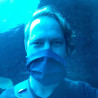

# About

Unhangout is an open source platform for running large-scale, participant-driven events online.

Each event has a landing page, which we call the lobby. When participants arrive, they can see who else is there and chat with each other. Hosts can welcome their community and do introductions in a video window that gets streamed into the lobby. Participants can then join breakouts, which are small group video chats, for in-depth conversations, peer-to-peer learning, and collaboration on projects.

**Unhangout facilitates participant-driven, community-based learning, rather than top-down information transfer.**

# The Team

Our small design and development team is (mostly) based at the MIT Media Lab in Cambridge, MA, USA.

  

    
    
Katherine McConachie

  

  

    
    
Charlie DeTar

  

  

    
    
Philipp Schmidt

  

  

    
    
Yumiko Murai

  

  

    
    
Dirk Uys

  

  
 
    
  

# Etc.

Unhangout is an open source project. You can find the code on [GitHub](https://github.com/mitmedialab/unhangout).

Questions? Say hello at [unhangout@media.mit.edu](mailto:unhangout@media.mit.edu)

